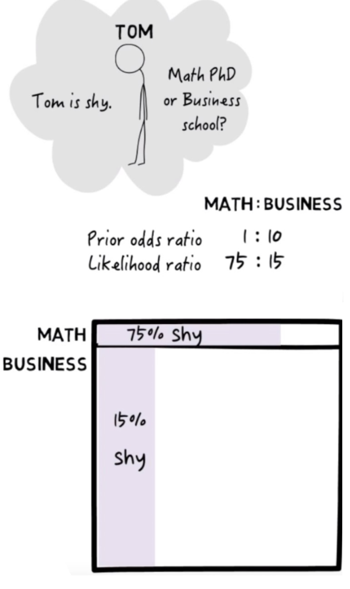
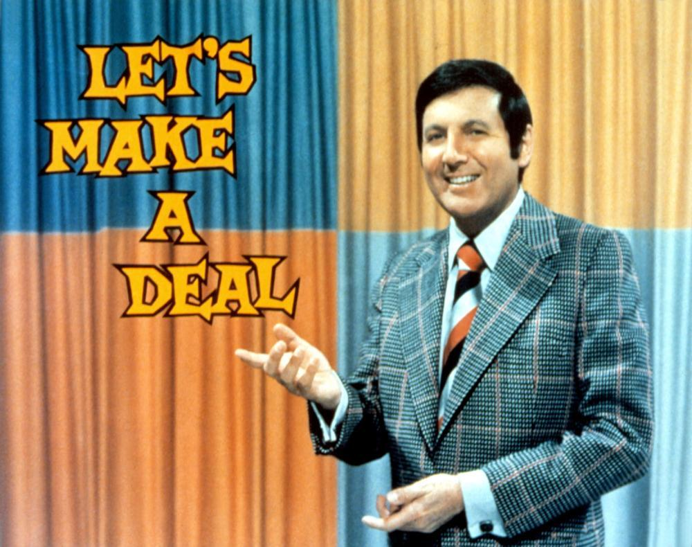
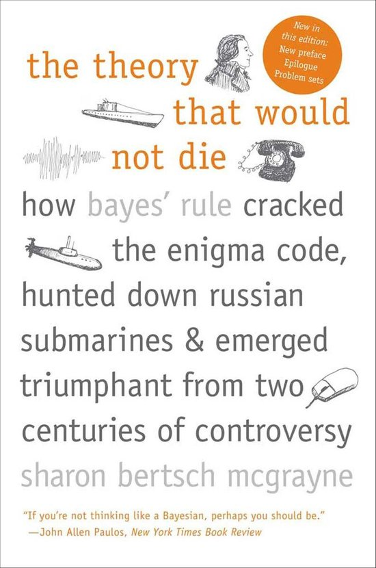

<style>
.column-left{
  float: left;
  width: 60%;
  text-align: left;
}
.column-right-small{
  float: right;
  width: 20%;
  text-align: right;
  padding-left: 10px;
}

.column-right-large{
  float: right;
  width: 40%;
  text-align: right;
  padding-left: 10px;
}

.column-full{
  float: none;
  width: 100%;
  text-align: central;
}


.RUsers {
  padding: 1em;
  background: aliceblue;
  color: black;
}


.SPSS {
  padding: 1em;
  background: whitesmoke;
  color: black;
}

</style>


```{r global-options, include=FALSE}
knitr::opts_chunk$set(eval = FALSE, message = FALSE)
library(magrittr)
library(knitr)
library(kableExtra)
library(emo)
library(gridExtra)
library(tidyverse)
library(janitor)
```


<div class="column-right-small" >

```{r pi, out.width="500px", echo=FALSE, eval=TRUE}



```

</div>


* Please submit your lab using [this link](https://docs.google.com/forms/d/e/1FAIpQLScFGWxA-NFSjIz1uB7vPakkEFXnXXMsVnotvFA48PwVDDJigg/viewform) .    
* If you have questions, please [book a slot](https://bit.ly/OferMeet) during Ofer's office hours!


In this lab you will start exploring the Bayesian equation and its consequences. 


## What is this shy student studying? 

We will try to simulate a sample dataset, reflecting the problem  that [Julia Galef](https://juliagalef.com/) presents in her video, [a visual guide to Bayesian thinking](https://www.youtube.com/watch?v=BrK7X_XlGB8). We need to create a data-set with two columns: 

* The first  column is a dummy variable, indicating whether a student belongs to the maths or to the business department. We assume that the theoretical odds ratio is 1:10, for students in each of these departments, respectively. Naturally, our sample may deviate from this somewhat. 
* The second column is also a dummy variable, indicating whether the student appears to be shy or not. We want the percentage of shy students to depend on the department they belong to, just as it appears in the figure on the right. 


```{r B_and_S, echo=TRUE, eval=FALSE}

# Let us start with creating the dummy variable for the students'
#  affiliation. We want the odds ratio of students with B=1 
#  (business students) to the students with B=0 (math students) 
#  to be 1:10. That means that the prior probability P(B=1) = p_B.  

# Set the seed to get the same results
# each time you run the script
# You may choose any seed you like!
set.seed(____)

# This is our sample size.
n <- _____

# The theoretical odds ratio of the student affiliation is 10:1, 
# that is, for every 10 students in the business department, 
# we will find one studying Maths. How would a sample taken from 
# this theoretical distribution look like? For each student, 
# we first want to know if they are in Business (B=1) or Maths (B=0).
studentBody <- data.frame(Business=rbinom(n, 1, ____))

# Confirm that in our sample, the odds ratio of students in 
# business:maths is roughly 10:1  For the following function you 
# will need to install and load library(janitor).
studentBody %>% 
  tabyl(____) %>% 
  adorn_pct_formatting()

# How many students in each faculty?
n.business  <- sum(____$____)
n.math      <- sum(1 - ____$____)
  
# Let us see which students are shy. We want to add a column, S, 
# whose value will be 1 if the student is shy and 0 otherwise. 
# We also want the probability that the student is shy to 
# depend on their affiliation, such that conditional 
# probability P(S=1|B=0) = 75% and P(S=1|B=1) = 15% 
# 
studentBody <- studentBody %>% 
  mutate(Shy=ifelse(Business==____, 
                    rbinom(n.business,1,p=____), 
                    rbinom(n.math,    1,p=____)))

# Now let us check the number of students in each category. 
# To do this, let us run the following command. Such a table 
# is called a contingency matrix. It shows us how many cases 
# we find in each category 
studentBody %>% 
  tabyl(Business, Shy) %>% 
  adorn_totals(where=c("row", "col"))

# To see the percentage of students in each category, run the following:
studentBody %>% tabyl(Business, Shy) %>% 
  adorn_percentages() %>% adorn_pct_formatting() %>% 
  adorn_title(placement = "top")

```


```{r B_and_S-hide, echo=FALSE, eval=FALSE, include=FALSE}
# Let us start with creating the dummy variable for the students'
# affiliation. We want the odds ratio of students with B=1 (business
# students) to the students with B=0 (math students) to be 1:10. 
# That means that the prior probability P(B=1) = p_B.  

# Set the seed to get the same results
# each time you run the script
# You may choose any seed you like!
set.seed(314)

# This is our sample size.
n <- 1000

# The theoretical odds ratio of the student affiliation is 10:1, 
# that is, for every 10 students in the business, we will find 
# one studying Math. How would a sample taken from this theoretical
# distribution look like? For each student, we first want to know 
# if they are in Business (B=1) or Maths (B=0).
studentBody <- data.frame(Business=rbinom(n, 1, 10/11))

# Confirm that in our sample, the odds ratio of students in 
# business:maths is roughly 10:1  For the following function you 
# will need to install and load library(janitor).
studentBody %>% 
  tabyl(Business) %>% 
  adorn_pct_formatting()

# How many students in each faculty?
n.business  <- sum(studentBody$Business)
n.math      <- sum(1-studentBody$Business)
  
# Let us see if the student is shy. We want to add a column, S, whose 
# value will be 1 if the student is shy and 0 otherwise. We also want 
# the probability that the student is shy depends on their affiliation, 
# such that conditional probability is P(S=1|B=0) = 0.75 
# and P(S=1|B=1) = 0.15. 
studentBody <- studentBody %>% 
  mutate(Shy=ifelse(Business==1, 
                    rbinom(n.business,1,p=0.15), 
                    rbinom(n.math,    1,p=0.75)))

# Now let us check the number of students in each category. To do this, 
# let us run the following command. Such a table is called a 
# contingency matrix. It shows us how many cases we find in 
# each category 
studentBody %>% 
  tabyl(Business, Shy) %>% 
  adorn_totals(where=c("row", "col"))

# To see the percentage of students in each category, 
# run the following:
studentBody %>% tabyl(Business, Shy) %>% 
  adorn_percentages() %>% adorn_pct_formatting() %>% 
  adorn_title(placement = "top")


s.lik       <- studentBody %>% filter(Business==0) %$% mean(Shy==1) 
s.prior     <- studentBody %$% mean(Business==0) 
s.marginal  <- studentBody %$% mean(Shy==1) 
s.posterior <- studentBody %>% filter(Shy==1) %$% mean(Business==0) 

s.lik*s.prior/s.marginal

```


### QUESTIONS:
1. Notice that in our sample, the odds ratio of shy students in the math and business department is not exactly 75:15. What can you do in order to make the numbers appear closer to this theoretical ratio? Try to do this, and recalculate the number of students in the 2x2 contingency matrix. 

1. From your sample, calculate the *likelihood*. This would be the conditional probability of Tom being being shy, assuming that Tom is in the maths department $P(S=1|B=0)$. 

1. From your sample, calculate the *Prior* of Tom being in the maths department $P(B=0)$, before even noticing whether Tom is shy or not. 

1. From your sample, calculate the *marginal probability* of Tom being shy, $P(S=1)$.

1. Now calculate the *posterior probability* of Tom being in the maths department, given that Tom is shy $P(B=0|S=1)$. Calculate this in two ways, and compare between your results: 

    * First, filter out all the non-shy students from your sample. Among the remaining shy students, find what proportion is in the maths department. 
    
    * Second, calculate the posterior from Bayes law: multiply the likelihood by the prior, and divide the result by the marginal. 
    
1. Now show that the odds ratio of the posterior equals the likelihood odds ratio times the prior odds ratio. 
$$
\frac{P(B=0|S=1)}{P(B=1|S=1)} = \frac{P(S=1|B=0)}{P(S=1|B=1)} \cdot \frac{P(B=0)}{P(B=1)} 
$$
1. Finally, notice that although the likelihood is pretty high (there are many shy students taking maths), the posterior is rather low. The posterior is proportional to the likelihood, so how do you explain this result? 


<div class="column-right-small" >

```{r monty-hall, out.width="500px", echo=FALSE, eval=TRUE}



```

</div>


## Solving the Monty Hall problem using Bayes theorem

The Monty Hall problem is a probability puzzle with a paradoxical answer that can be explained by Bayesian inference.
You are a guest on a television game show and have the opportunity to win a new car. The host shows you three doors. The car is behind one of the doors; behind the other doors are goats. You must choose which door to open.
You pick a door. The host then opens up one of the other doors to show a goat. He offers you the chance to change your mind and pick the other unopened door instead of the one you have chosen. Do you switch?


Write this down as a probability model where $\theta$ is a binary parameter that takes the value 1 if you have chosen the door with the car or 0 if you have not. Let $Y$ be a binary outcome variable that takes the value 1 if the door opened by the host has a car behind it and 0 if has a goat behind it.


<div class="column-right-large" >
```{r kusama, fig.width=4,fig.height=4, echo=FALSE, eval=TRUE}

```
</div>

### QUESTIONS:
1. Consider that the host *does not know* what is behind each door. The host opens a door at random. Now: 

    * Write down the prior distribution on $\theta$. In other words, write a function that will take the $\theta$ as an input and will calculate the probability for that $\theta$. Call the function $P(\theta)$. This will be our prior.
    * Write down the likelihood $P(Y = 0| \theta)$
    * Use Bayes' theorem to calculate the posterior $P(\theta = 1| Y=0)$
    * To maximize your chance of opening a door with the car, should you stay with your original choice of door? 
    
    
2. The host *knows* what is behind each door and chooses to open one with a goat. Now: 

    * Write down the prior distribution on $\theta$. In other words, write the probability for each possible value of $\theta$: $P(\theta=0)$ and $P(\theta=1)$
    * Write down the likelihood $P(Y = 0| \theta)$
    * Use Bayes' theorem to calculate the posterior $P(\theta = 1| Y=0)$
    * To maximize your chance of opening a door with the car, should you stay with your original choice of door? 


