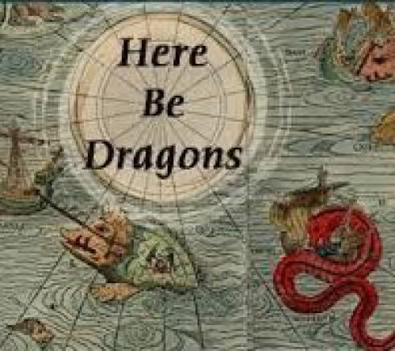
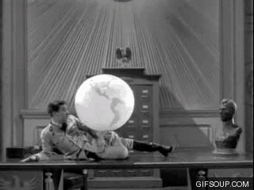

<style>
.column-left{
  float: left;
  width: 60%;
  text-align: left;
}
.column-right-small{
  float: right;
  width: 20%;
  text-align: right;
  padding-left: 10px;
  font-size:10px;
}

.column-right-large{
  float: right;
  width: 40%;
  text-align: right;
  padding-left: 10px;
}

.column-full{
  float: none;
  width: 100%;
  text-align: centre;
}


.column-full-left{
  float: none;
  width: 100%;
  text-align: left;
}

.center {
  height: 200px;
  border: 0px;
  text-align: center;
}


.RUsers {
  padding: 1em;
  background: aliceblue;
  color: black;
}


.SPSS {
  padding: 1em;
  background: whitesmoke;
  color: black;
}

</style>


```{r global-options, include=FALSE}
knitr::opts_chunk$set(eval = FALSE, message = FALSE)
library(magrittr)
library(knitr)
library(kableExtra)
library(emo)
library(gridExtra)
library(tidyverse)
library(janitor)
```


<div class="column-right-large">


```{r pi, out.width="500px", echo=FALSE, eval=TRUE}



```

</div>

<div class="column-left" >

* Please submit your lab using [this link](https://docs.google.com/forms/d/e/1FAIpQLSfXX-wXNueJqj85Dv-Y2but1v7ejVigK4V5nGH7l3yK2QDGSw/viewform).   
* If you have questions, please [book a slot](https://bit.ly/OferMeet) during Ofer's office hours!


In this lab we explore the likelihood, the log-likelihood, and why on Earth we would like to maximize those monsters. If you find all of this a bit confusing, go ahead and watch [this 6min video](https://bit.ly/3LIobzf). 


## Submit *THREE* of the questions below for a pass

You may choose any three of the ten problems 1.a to 1.f, 2.a to 2.d. Solve them in your lab report for a pass. 


Choose three numbers, and assume they are three observations, randomly sampled from a normal distribution with two parameters: $\mu, \sigma$. Unfortunately, we don't know the distribution's parameters. We can never observe parameters directly, we can only observe statistics measured in our samples. Like the Gods, parameters are invisible to the eyes of mortals, and statistics are Their messengers. 
</div>


<div class="column-full-left" >
Had we known the parameters of the distribution  $\mu, \sigma$, we would know the probability density of observing any specific value $x$ is:
$$f(X=x|\mu, \sigma) = \frac{1}{\sqrt{2\pi}\sigma}e^{-\frac{(x-\mu)^2}{2\sigma^2}} $$ 
The probability density of observing multiple independent values  $x_1, x_2, ..., x_n$ is 

$$f(X=x_1, x_2, ... x_n |\mu, \sigma) = \prod_{i=1..n}f(X=x_i|\mu, \sigma) \\
= \prod_{i=1..n}\frac{1}{\sqrt{2\pi}\sigma}e^{-\frac{(x_i-\mu)^2}{2\sigma^2}} $$ 

```{r read-var, eval=TRUE, echo=FALSE, include=TRUE}
# Read in your random variable in the following manner:

sample.from.norm <- read.csv("https://bit.ly/3uZsuQv")


```


```{r hide-ex2, eval=TRUE, echo=FALSE, include=FALSE}
library(tidyverse)
library(metR) # <-- this library for the contour plot...

# likelihood: given the parameters of a normal distribution, 
# sigma and mu, what is the probability of observing 
# a certain outcome, x
# p(x|mu,sigma) = dnorm(x, mean=mu, sd=sigma )
lik <- function(x, mu, sigma){
  return(sum(log(dnorm(x, mean=mu, sd=sigma))))  
}

# Now we want to create a data frame with combinations of 
# mu and sd
df <- expand.grid(mu = seq(2,4, b=.02), 
                  sigma = seq(4.5,6, b=.02))


# Here we calculate the log-likelihood for each combination
df$loglik <- rep(NA, nrow(df))
for(i in 1:nrow(df)){
  mu    <- df$mu[i]
  sigma <- df$sigma[i]
  df$loglik[i] <- lik(sample.from.norm$rVariable, mu, sigma)
}


```

 


This probability is also known as the likelihood. It defines the probability of making a set of observations, assuming that we are drawing from a theoretical distribution. 

</div>

<div class="column-right-small" >


```{r phases, eval=TRUE, echo=FALSE, fig.height=3, fig.width=3}

params <- expand.grid(mu = seq(-.25,.25, b=.25), 
                  sigma = seq(.5,1, b=.25))
for(i in 1:nrow(params)){
  params$lik[i] <- prod(dnorm(c(-1,0,1), 
                            params$mu[i], 
                            params$sigma[i]))   
}

params$r.lik <- rank(params$lik)


ggplot(params) + 
  geom_point(aes(x=mu, y=sigma, color=r.lik), size=3) +   
  scale_color_binned(type = "viridis")  + 
  theme(legend.position = "bottom")

```

The figure above suggests that the region of highest likelihood is in the vicinity where $\mu=0$ and $\sigma \in [^3/_4, 1]$

</div>


<div class="column-full-left" >
Suppose I chose the three numbers $-1, 0, 1$. For these numbers, we can imagine that the mean of the theoretical probability distribution from which they were drawn is in the vicinity of $\mu \in [-\frac{1}{4},\frac{1}{4}]$ and the standard deviation is in the vicinity of $\sigma \in [\frac{1}{2},1]$. So we want to check the probability of making these observations using combinations of possible $\mu, \sigma$. 


1.a. Choose three numbers (numbers different than the ones I chose above), and then choose the boundaries of the parameter space, $\mu, \sigma$  which you want to explore. Choose three values for each of those parameters and then calculate the likelihood for each of the nine combinations. Which combination in the parameter space yields the highest likelihood? 

1.b. Try choosing a narrower parameter space around the point that maximizes the likelihood, and repeat this exercise. Your objective is to locate the parameters that maximize the likelihood with greater precision.   

</div>
<div class="column-right-large">

```{r show-contour, eval=TRUE, echo=FALSE, fig.height=4, fig.width=4, message=FALSE, warning=FALSE, include=TRUE}

mu_mle <- mean(sample.from.norm$rVariable)
sd_mle <- sqrt(var(sample.from.norm$rVariable)*99/100)


bx <- round(c(mu_mle + c(-1,1) %o% seq(0,2,by=.2)),2)
by <- round(c(sd_mle + c(-1,1) %o% seq(0,2,by=.2)),2) 

b <- c(round(log(seq(exp(-315), exp(-306.3258), length.out=9)),2))

df %>%  
  ggplot(aes(x=mu, y=sigma, 
             z=loglik)) +
  geom_contour() + 
  geom_text_contour() + 
  geom_vline(xintercept = mu_mle, color="grey", alpha=.8) + 
  geom_hline(yintercept = sd_mle, color="grey", alpha=.8) + 
  scale_x_continuous(breaks=bx)+ 
  scale_y_continuous(breaks=by, limits=c(4.5,6))


```

<br/>
</div>

<div class="column-full-left" >
From a simple example of only three observations, we now move to an example of 100 observations. You will find the data for these observations as the second variable `rVariable` in [this dataset](https://bit.ly/3uZsuQv).

When we have larger datasets, it is often mathematically more convenient to look at the log of the likelihood, and not the likelihood. The parameters that maximize the log-likelihood are also known as the log-likelihood estimates of our parameters. In what follows, we are going to calculate a number of combinations of parameters $\mu, \sigma$ and find which combination maximizes the log likelihood for our observations. 

First, we  create a function to calculate the log likelihood for our data, given a set of parameters. Then, we create a data-frame with combinations of parameters, where $\mu\in[2,4]$ and $\sigma\in[4,6]$. Notice that this range contains what we believe are the  real parameters. We hope that the log likelihood would be maximized for a combination of parameters in the vicinity of the real parameters. 


1.c. Remember that the log of a product equals the sum of the logs. This means that $\log(x_1\cdot x_2\cdot x_3...) = log(\prod_i x_i) = \sum_i \log( x_i)$. Using this equation, *write an expression* for the log-likelihood: 

$$
\log\Big[f(X=x_1, x_2, ... x_n |\mu, \sigma)\Big]
$$ 

1.d. Instead of maximizing the likelihood, it is common practice to maximize the log-likelihood. Can you explain why? 

1.e. Create a heat-map or a contour map showing the distribution of the log-likelihood, depending on the parameters  $\mu, \sigma$. Add vertical and horizontal straight lines to illustrate the parameters that maximize the log likelihood (see the code below). Read the random data into R using `read.csv("https://bit.ly/3uZsuQv")`.

1.f. What are the values of the parameters $\mu, \sigma$ that maximize the log-likelihood? What is the maximum log-likelihood for those values? How do these values compare to the *mean* and *standard deviation* of the sample observations? Show that your results suggest that one of the maximum likelihood estimations  is unbiased and that the other [is biased](https://www.youtube.com/watch?v=u2liUsAC61k). Is this bias an underestating or overestating the standard deviation? What does it mean to say that an estimate is biased?  

 

```{r show-ex2, eval=FALSE, echo=TRUE, include=TRUE}

library(tidyverse)
library(metR) # <-- this library for the contour plot...

# likelihood: given the parameters of a normal distribution, 
# sigma and mu, what is the probability of observing 
# a certain outcome, x
# p(x|mu,sigma) = dnorm(x, mean=mu, sd=sigma )
lik <- function(x, mu, sigma){
  return(sum(log(dnorm(x, mean=mu, sd=sigma))))  
}

# Now we want to create a data frame with combinations of 
# potential values for mu and sigma. You may want to 
# decrease the range of parameters or the number of 
# combinations to improve your plot.
df <- expand.grid(mu = seq(2,4, b=.02), 
                  sigma = seq(4,6, b=.02))


# Here we calculate the log-likelihood for each combination
df$loglik <- rep(NA, nrow(df))
for(i in 1:nrow(df)){
  mu    <- df$mu[i]
  sigma <- df$sigma[i]
  df$loglik[i] <- lik(X$rVariable,mu,sigma)
}

# The following creates a ranking of the log likelihood, 
# which makes it easier to see the graphs
df$r.loglik <- rank(df$loglik)

# Finally, we plot a heat map and a contour map, 
# a representation of a three dimensional space where the x-axis
# represents the mu, the y-axis represents the standard deviation, 
# and the colour or contour represents the log likelihood.
df %>%
  ggplot(aes(x=mu, y=sigma,
             fill=r.loglik)) +
  geom_tile() + scale_fill_binned(type = "viridis")  


df %>%  
  ggplot(aes(x=mu, y=sigma, 
             z=r.loglik)) +
  geom_contour() + 
  geom_text_contour() 

```

</div>


# Globe tossing 


<div class="column-right-small">


```{r chaplin, out.width="500px", echo=FALSE, eval=TRUE}

```

Chaplin in the [globe scene](https://www.youtube.com/watch?v=-jj-PaqFrBc)

<br/>
<br/>

```{r rethinking, out.width="500px", echo=FALSE, eval=TRUE}
include_graphics("images/rethinking.png")

```
The questions are audaciously taken from coursework made publicly available by Richard McElreath.  
</div>


Before starting, consider reviewing the EASY problems at the end of Chapters 1, 2 and 3 in McElreath's [Statistical Rethinking](https://xcelab.net/rm/statistical-rethinking/) book

2.a Suppose the globe tossing data data (Chapter 2) had turned out to be 4 water and 11 land. Construct the posterior distribution, using grid approximation. Use the same flat prior as in the book.

2.b Now suppose the data are 4 water and 2 land. Compute the posterior again, but this time use a prior that is zero below $p = 0.5$ and a constant above $p = 0.5$. This corresponds to prior information that a majority of the Earth’s surface is water.

2.c For the posterior distribution from 2, compute 89% percentile and HPDI intervals. Compare the widths of these intervals. Which is wider? Why? If you had only the information in the interval, what might you misunderstand about the shape of the posterior distribution?

2.d Suppose there is bias in sampling so that Land is more likely than Water to be recorded. Specifically, assume that 1-in-5
(20%) of Water samples are accidentally recorded instead as ”Land”. First, write a generative simulation of this sampling process. Assuming the true proportion of Water is 0.70, what proportion does your simulation tend to produce instead? Second, using a simulated sample of 20 tosses, compute the unbiased posterior distribution of the true proportion of water.
<br/>

