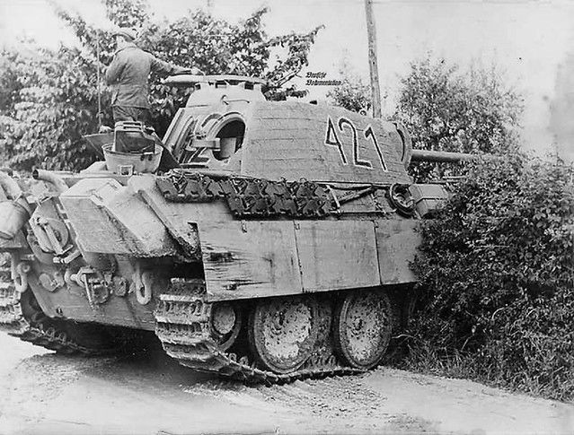

<style>
.column-left{
  float: left;
  width: 60%;
  text-align: left;
}
.column-right-small{
  float: right;
  width: 20%;
  text-align: right;
  padding-left: 10px;
  font-size:10px;
}

.column-right-large{
  float: right;
  width: 40%;
  text-align: right;
  padding-left: 10px;
}

.column-full{
  float: none;
  width: 100%;
  text-align: centre;
}


.column-full-left{
  float: none;
  width: 100%;
  text-align: left;
}

.center {
  height: 200px;
  border: 0px;
  text-align: center;
}


.RUsers {
  padding: 1em;
  background: aliceblue;
  color: black;
}


.SPSS {
  padding: 1em;
  background: whitesmoke;
  color: black;
}

</style>


```{r global-options, include=FALSE}
knitr::opts_chunk$set(eval = FALSE, message = FALSE)
library(magrittr)
library(knitr)
library(kableExtra)
library(emo)
library(gridExtra)
library(tidyverse)
library(janitor)
```


<div class="column-right-large">


```{r pi, out.width="500px", echo=FALSE, eval=TRUE}



```
<!-- <br/> -->
<!-- <br/> -->
<!-- <br/> -->
<!-- <br/> -->

</div>

<div class="column-left" >

* Please submit your lab using [this link](https://docs.google.com/forms/d/e/1FAIpQLSdWdqWg2vh9OkDuoPb03Ky46SrnsaNfyXkiYaJShRBt8HpLiA/viewform).   
* If you have questions, please [book a slot](https://bit.ly/OferMeet) during Ofer's office hours!


In this lab we show how the Bayesian framework could help solve an actual problem faced by the Western Allies during the Second World War.    


### The German tank problem

During the course of the Second World War, the Western Allies made sustained efforts to determine the extent of German tank production. They approached this problem using conventional intelligence and through statistical estimation, which became ever more pressing shortly before D-Day, when rumours started surfacing, suggesting that large numbers of Panzer V tanks were being used.

</div>

<div class="column-full-left" >

To estimate the number of tanks being produced, allies used the serial numbers on captured or destroyed tanks. The principal numbers used were gearbox numbers, chassis, engine numbers and various other components. 

In what follows, we will simplify the problem substantially. Consider that the number of tanks being deployed is `n.tanks`. This is a number that cannot be  observed directly. The tanks are marked uniquely with a serial number $s_{nr}\in[1..n_{tanks}]$. 

Further, assume that each tank has the same probability to be captured by the allies, so that each serial number has an equal probability of being observed. Once a tank is captured, its serial number is registered as an observation: `s.nr`. From this observation we construct our posterior distribution, the probability that the number of tanks is $n_{hyp.tanks}$, given an observation $s_{nr}$ is $P(n_{hyp.tanks}|s_{nr})$.   

As a first step, we construct our prior. This means, that we associate an equal probability for every hypothesized number of tanks that deployed.   

```{r prior, echo=TRUE, eval=FALSE}

set.seed(____) 


# Start with a range of hypothesis regarding 
# the true value of n.tanks

# We limit our analysis to a range of hypotheses regarding
# the possible number of tanks
max.n <- _______     # the max we are willing to consider
hyp.range <- 1:max.n # the range of hypotheses

# Our prior associates the *same* value
# to each hypothesis in the range of our hypotheses. 
# We aren't worried about the absolute probability, 
# but only about them all being equal
prior <- rep(1, max.n)


# Now let's calculate the likelihood, p(obs|hypothesis), 
# in a dedicated function. 
# 
# Given a hypothesis about the number of tanks, *hyp*, 
# calculate the probability of observing *obs*
f.likelihood <- function(obs, hyp) {
# Assume that:
# 1. If the hypothesis is smaller than your observation, 
# the probability to make that observation is zero.
# 2. Otherwise, any serial number observed is equally 
# likely 
  
}


# Now let's calculate the posterior, p(hypothesis|obs), 
# in a dedicated function. 
# 
f.posterior <- function(obs, prior) {
# For each of the possible hypotheses in hyp.range, we 
# need to associate a probability. 
# Using the observation obs, calculate the likelihood
# for each hypothesis in  hyp.range
likelihood <- f.likelihood(_______, _______)

# Now multiply the likelihood by the posterior, and 
# divide the result by the sum of this product.
posterior <- (_______*_______/sum(_______*_______))
return(posterior)

}
  
```


```{r helping-functions, echo=FALSE, include=FALSE, eval=TRUE}

n.tanks <- 246
max.n <- 1000       # the max we are willing to consider
hyp.range <- 1:max.n # the range of hypotheses

prior <- rep(1, max.n)

pr.obs.given.hyp <- function(obs, hyp) {
  return(ifelse(obs>hyp,0,1/hyp))
}


pr.hyp.given.obs <- function(obs, prior) {
   likelihood <- pr.obs.given.hyp(obs, hyp.range)
   return(likelihood*prior/sum(likelihood*prior))
}
set.seed(666)

obs1 <- sample(1:n.tanks, 1)
obs2 <- sample(1:n.tanks, 1)
obs3 <- sample(1:n.tanks, 1)
obs4 <- sample(1:n.tanks, 1)
obs5 <- sample(1:n.tanks, 1)


```


<div class="column-right-large">

```{r post1, eval=TRUE, echo=FALSE, fig.height=4, fig.width=4, message=FALSE, warning=FALSE}

post1 <- pr.hyp.given.obs(obs1, prior)
post2 <- pr.hyp.given.obs(obs2, post1)
post3 <- pr.hyp.given.obs(obs3, post2)
post4 <- pr.hyp.given.obs(obs4, post3)
post5 <- pr.hyp.given.obs(obs5, post4)

d <- data.frame(hyp.range, post1, post2, post3, post4, post5) %>% 
  pivot_longer(cols=c("post1","post2","post3", "post4", "post5")) %>% 
  mutate(posterior=factor(name, levels=c("post1","post2","post3", "post4", "post5")))

ggplot(d) + 
  geom_line(aes(x=hyp.range, y=value, color=posterior)) + 
  scale_x_continuous(breaks=seq(50,350,by=50), limits=c(50,360), name="hypothesized number of tanks") + ylab("posterior density") + 
  theme(legend.position = "bottom")

```


</div>

<div class="column-full-left" >

Now that all our functions are in place, we simulate capturing a tank. To find its serial number we sample from a uniform discrete distribution that ranges between 1 and the unknown number `n.tanks`. Using the help-functions above, we can then calculate the posterior and plot it. For example, in my code I have sampled the following observation: `obs_1=` `r obs1`. The posterior could be then plotted against the hypothesized number of tanks. We can now take a second observation, in this case `obs_2=` `r obs2`. We will take the posterior of the first observation, and feed it as the prior of our second observation. Thus, our second posterior will take into account both observations. With every additional observation, we see how the posterior becomes more concentrated around the real number of tanks. 

#### Questions: 

1. Reproduce a plot of 7-10 posterior distributions as shown in the figure on the right. For each posterior, calculate the 90% highest density posterior interval (HDPI, or the narrowest range of our hypothesized tank-count which covers 90% of the distribution). Discuss your results, describe the plot, and explain what you understand from this exercise (any relevant reflections are most welcome).  
</div>
<div class="column-right-small">


```{r shirt, out.width="500px", echo=FALSE, eval=TRUE}

# 

```
<!-- <br/> -->
<!-- <br/> -->
<!-- <br/> -->
<!-- <br/> -->

</div>

<div class="column-left-large">

2. Now create a plot using `geom_ribbon`, to show how the uncertainty around the real tank-count value diminishes with every additional observation. Explain what the graph is showing, and discuss relevant reflections you might have. 

```{r bonus, echo=FALSE, message=FALSE, warning=FALSE, eval=TRUE, include=TRUE}

n.observations <- 50
percentile.90 <- data.frame(index=rep(NA,n.observations),
                            min=rep(NA,n.observations), 
                            max=rep(NA,n.observations), 
                            obs=rep(NA,n.observations))
prior <- rep(1, max.n)
set.seed(666)
for(i in 1:n.observations){
  obs <- sample(1:n.tanks, 1)
  post <- pr.hyp.given.obs(obs, prior)
  percentile.90[i,] <- 
    c(i, hyp.range[sum(cumsum(post)==0)]+1, 
         hyp.range[sum(cumsum(post)<0.90)], obs)
  prior <- post
}
# percentile.90
ggplot(percentile.90) + 
  # geom_point(aes(x=index, y=obs), color="red", size=1) +
  geom_ribbon(aes(x=index, 
                   ymin=min, 
                   ymax=max), alpha=.4) + 
  geom_hline(yintercept = n.tanks, color="red", alpha=.6) + 
  scale_y_log10(name="90% credibility interval", 
                breaks=c(200,246, 300, 400, 500, 800)) + 
  scale_x_log10(name="observation number", 
                breaks=c(1,3,5,12, 21, 30 , 50))


```


</div>
