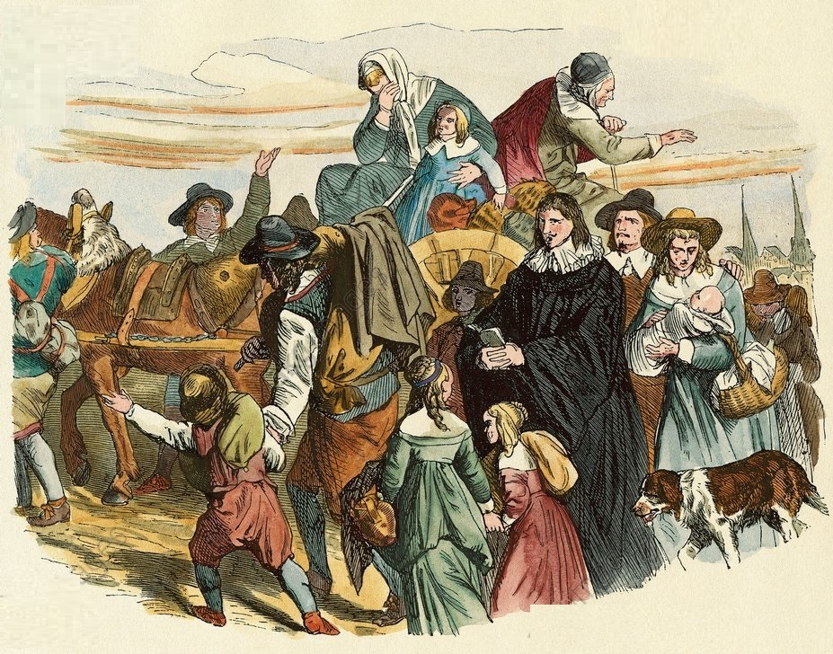

<style>
.column-left{
  float: left;
  width: 60%;
  text-align: left;
}
.column-right-small{
  float: right;
  width: 30%;
  text-align: right;
  padding-left: 10px;
  font-size:10px;
}

.column-right-large{
  float: right;
  width: 40%;
  text-align: left;
  padding-left: 10px;
}

.column-full{
  float: none;
  width: 100%;
  text-align: centre;
}


.column-full-left{
  float: none;
  width: 100%;
  text-align: left;
}

.center {
  height: 200px;
  border: 0px;
  text-align: center;
}


.RUsers {
  padding: 1em;
  background: aliceblue;
  color: black;
}


.SPSS {
  padding: 1em;
  background: whitesmoke;
  color: black;
}

</style>


```{r global-options, include=FALSE}
knitr::opts_chunk$set(echo = FALSE, message = FALSE)
library(magrittr)
library(knitr)
library(kableExtra)
library(emo)
library(gridExtra)
library(tidyverse)
library(janitor)
library(modelsummary)
```


<div class="column-right-large">


```{r salt, out.width="500px", echo=FALSE, eval=TRUE}



```

Arrival of French Huguenot immigrants in Brandenburg after the Great Elector Frederick William issued the Edict of Potsdam in 1685. Illustration for Weltgeschichte Fur Das Volk by Otto von Corvin and Wilhelm Held (Verlag und Druck von Otto Spamer, 1880).

</div>

<div class="column-full-left" >

* Please submit your lab using [this link](https://docs.google.com/forms/d/e/1FAIpQLSdZJEndcian0_EGO6tbwoYi-f8FalRe2JPmzVc2bcyFsq9hGw/viewform).   
* If you have questions, please [book a slot](https://bit.ly/OferMeet) during Ofer's office hours!

### Simulating the operation of an instrumental variable

We will first create fake data to simulate the operation of an instrumental variable. Using [dagitty.net](http://dagitty.net/dags.html), create a DAG with an treatment, $T$ that links to an outcome, $Y$. Add a confounder, $U$ with causal links to both the treatment and the outcome. Finally, add a binary instrument, $Z\in\{0,1\}$, which links to the treatment alone.

Now create fake data, simulating the data generating process represented by your DAG. You will need to specify your model. For example, consider the following model: 

$$
\begin{aligned}
Z &\sim 
  \begin{cases}
    p=\frac{1}{2}     & \text{if $z = 1$}, \\
    p=\frac{1}{2} & \text{if $z = 0$}
  \end{cases}  \\
U &\sim \mathcal{N}(\mu=0, \sigma=1)  \\
T &\sim \mathcal{N}(\mu=\alpha_1\cdot Z +\alpha_2\cdot U, \sigma=1)  \\
Y &\sim \mathcal{N}(\mu=\beta_1\cdot T+\beta_2\cdot U, \sigma=1)  \\
\end{aligned}
$$
1. Now let us explore our data as follows:

-   Add a snapshot of the DAG you created to your lab report. 
-  Plot the distributions of your variables, and a scatter-plot to show the relationship between the variables of interest. 
-   Regress the outcome $Y$ against the treatment $T$ and interpret the estimates. Are the estimates biased?
-   Regress the outcome $Y$ against the treatment $T$ and $U$ and interpret the estimates. Are the estimates biased?
-   Without using the unobserved confounder $U$, use the instrument $Z$ to produce a model with unbiased estimates of the causal effect of interest. Estimate the effect using the 2SLS approach by hand, and by using the `ivreg`  function from the **AER** library. Note that `ivreg` formula syntax is `Y ~ T  | Z `, where `T` is treatment, and `Z` is the instrument.

### Replicating Hornung (2014) : Immigration and the Diffusion of Technology

We will now replicate [this](https://www.aeaweb.org/articles?id=10.1257/aer.104.1.84) paper which looks at the influence of the mass emigration of French [Huguenots to Prussia](https://en.wikipedia.org/wiki/Edict_of_Potsdam) in the 17th century. It specifically looks at the effect of skilled immigration to places with underused economic potential on their productivity. It instruments for immigration with population loss in a Prussian area during the Thirty Years’ War - immigrants were encouraged to move to places that had lost a lot of people. You can find the dataset [here](https://bit.ly/3CUSzSK), variable descriptions are available below. 

2. Run a linear regression for the "first stage" of this IV analysis, regressing the measure of immigration on the instrument and all controls. Comment on what you see, keeping in mind that the Stock and Yogo cutoff for one treatment and one control to ensure that IV bias is less than 10% of OLS bias is 16.38. Outside of Stock & Yogo, any major concerns from what you see in this regression?

3. Ignoring the controls, produce a scatterplot graph with immigration on the y-axis and the instrument on the x-axis. Comment on what you see. Does this look like a strong relationship? Does the relationship look linear? 


| Variable | Description |
| -------- | ----------- |
| ln_output1802_all | (ln) Output (the dependent variable) |
| hugue_1700_pc | % Huguenots 1700 (a measure of immigration) |
| poploss_keyser | Pop losses in 30 Years’ War, Keyser (the instrument) |
| ln_workers1802_all | (ln) Workers |
| ln_looms1802_all | (ln) Looms |
| mi_ln_input1802_all | (ln) Value of Materials (imputed) |
| no_looms | Not using looms (dummy) |
| ln_popcity1802 | (ln) Town Population 1802 |
| vieh1816_schaf_ganz_veredelt_pc | Merino sheep p.c. 1816 (county) |
| pop1816_prot_pc | % Protestant |
| no_hugue_possible | Not Prussia in 1700 (dummy) |
| imputed_dummy | Dummy for imputed values |
| textil_1680_dummy | Relevant textile production before 1685 (dummy) |


```{r eval=FALSE, echo=FALSE, message=FALSE, warning=FALSE, include=FALSE}
hr <- read_csv("data/iv_hornug_data.csv")


```


4. Run two 2SLS regressions, and display their estimates in a shared table. 

*   First, estimate 2SLS "by hand" by estimating the first stage like in Step 2, getting the predicted values, and using that in the second stage (remember, the standard errors for this one will definitely be wrong). 
*   Second, estimate the same model (again using 2SLS) but using a command specially designed to estimate IV. Then, show both regression results on a shared table (optionally, you may make the table show only the coefficient on the immigration variable, if you'd like it to be a bit cleaner).
* To add the predicted values to the data, you'll need to deal with the fact that some observations were dropped from the data to estimate the model, so there are fewer predicted values than rows in the data. This can be solved by using `predict(model, newdata = hr)` instead of just `predict(model)`. 


5. Run a third 2SLS model, this time with adding the square of the instrument as a second instrument. Show the F statistic testing whether the coefficients on the instrument are jointly 0, and comment on what you see (the Stock and Yogo cutoff from Step 2 is now 19.93, note). Then, show the results of this third 2SLS model on the same table as the first two models from the previous step.

6. For the model with two instruments, we can run an over-identification test. Comment on whether an overidentification test makes sense in this context or not, *and why*. Then, regardless of whether it makes sense, run the test (the Sargan, if you have a choice) and interpret the result.

7. Re-estimate the same model, but this time using GMM to estimate the model. Show the results in a table shared with the previous models

8. Re-estimate the 2SLS model using Anderson-Rubin confidence intervals. Comment on how this changes the results relative to the last model you ran earlier.

- You'll first need to re-estimate your  model using the `ivreg` function from the **AER** library. Note that `ivreg` formula syntax is `Y ~ T + X | Z + X`, where `T` is treatment, `Z` is the instrument, and `X` are controls. 


</div>
