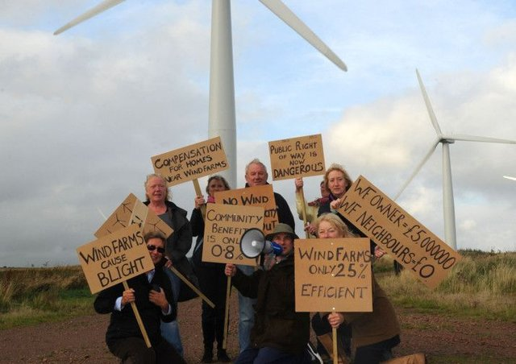

<style>
.column-left{
  float: left;
  width: 60%;
  text-align: left;
}
.column-right-small{
  float: right;
  width: 30%;
  text-align: right;
  padding-left: 10px;
  font-size:10px;
}

.column-right-large{
  float: right;
  width: 40%;
  text-align: left;
  padding-left: 10px;
}

.column-full{
  float: none;
  width: 100%;
  text-align: centre;
}


.column-full-left{
  float: none;
  width: 100%;
  text-align: left;
}

.center {
  height: 200px;
  border: 0px;
  text-align: center;
}


.RUsers {
  padding: 1em;
  background: aliceblue;
  color: black;
}


.SPSS {
  padding: 1em;
  background: whitesmoke;
  color: black;
}

</style>


```{r global-options, include=FALSE}
knitr::opts_chunk$set(echo = FALSE, message = FALSE)
library(magrittr)
library(knitr)
library(kableExtra)
library(emo)
library(gridExtra)
library(tidyverse)
library(janitor)
library(modelsummary)
library(AER)
```


<div class="column-full-left" >

* Please submit your lab using [this link](https://docs.google.com/forms/d/e/1FAIpQLSdZJEndcian0_EGO6tbwoYi-f8FalRe2JPmzVc2bcyFsq9hGw/viewform).   
* If you have questions, please [book a slot](https://bit.ly/OferMeet) during Ofer's office hours!

### Simulating the operation of an instrumental variable


<div class="column-right-large">


```{r salt, out.width="500px", echo=FALSE, eval=TRUE}



```

Stokes (2016) uses a natural experiment to demonstrate how  citizens punish incumbent governments for progressive climate policy, leading to electoral losses for the incumbent party ranging from 4 to 10%, with the effect persisting 3 km from wind turbines.
</div>


We will first create fake data to simulate the operation of an instrumental variable. Using [dagitty.net](http://dagitty.net/dags.html), create a DAG with an treatment, $T$ that links to an outcome, $Y$. Add a confounder, $U$ with causal links to both the treatment and the outcome. Finally, add a binary instrument, $Z\in\{0,1\}$, which links to the treatment alone.

Now create fake data, simulating the data generating process represented by your DAG. You will need to specify your model. For example, consider the following model (you may choose other, perhaps more complex models): 

$$
\begin{aligned}
Z &\sim 
  \begin{cases}
    p=\frac{1}{2}     & \text{if $z = 1$}, \\
    p=\frac{1}{2} & \text{if $z = 0$}
  \end{cases}  \\
U &\sim \mathcal{N}(\mu=0, \sigma=1)  \\
T &\sim \mathcal{N}(\mu=\alpha_1\cdot Z +\alpha_2\cdot U, \sigma=1)  \\
Y &\sim \mathcal{N}(\mu=\beta_1\cdot T+\beta_2\cdot U, \sigma=1)  \\
\end{aligned}
$$
1. Now let us explore our data as follows:

-   Add a snapshot of the DAG you created to your lab report. How would your DAG change if you had one variable, mediating between instrument and outcome, and another, confounding on instrument and outcome. Given these variables, what would you need to do in order to identify the effect of the treatment on the outcome? 
-   Plot the distributions of your variables, and visualize the data to show  relationships between variables of interest. Assuming that the data was observed (rather than simulated), how would you know that  your instrument is *relevant* and *valid*? 
-   Regress the outcome $Y$ against the treatment $T$ and interpret the estimated parameters. Are the estimates biased?
-   Regress the outcome $Y$ against the treatment $T$ and $U$ and interpret the estimates. Are the estimates biased?
-   Without using the unobserved confounder $U$, use the instrument $Z$ to produce a model with unbiased estimates of the causal effect of interest. Estimate the effect using the 2SLS approach by hand, and by using the `ivreg`  function from the **AER** library. Note that `ivreg` formula syntax is `Y ~ T  | Z `, where `T` is treatment, and `Z` is the instrument.

### Replicating Stokes (2015) : Electoral backlash against climate policy

We will now replicate [an article](https://onlinelibrary-wiley-com.proxy-ub.rug.nl/doi/full/10.1111/ajps.12220) in which Leah Stokes (2016) examines whether governments are punished electorally for building wind farms, a policy that mitigates climate change but may impose costs on the communities where turbines are sited. She looks at Ontario in Canada, where from 2009 the provincial government removed local communities' rights to make planning decisions on the building of wind turbines. Instead, decision-making was centralised and turbines were imposed by the government. It chose to build turbines in places where their construction was most feasible and they would generate the most electricity. In particular, they were more likely to be sited in places with higher prevailing wind speeds. Whilst certain broad areas are in general better suited for turbines (more rural and more elevated places, and areas closer to the windy great lakes), she argues that within these broad areas wind speed varies at random at the local level. This means that local communities could not select out of (or into) receiving a wind farm based on their levels of support for the policy or for the government. This is therefore a natural experiment where wind speed is an instrument that randomly encouraged the government to site turbines in particular places. 

Her outcome of interest is change in support for the incumbent government from 2007 (before the wind farm policy) to 2011 (after it began) at a highly localised level known as "precincts" in Canada, which typically contain around 300 voters. Using GIS software, she geo-located all wind turbines that were built or proposed in the period and matched them to precincts, where she collected voting data, localised prevailing wind speeds, and background covariates. The dataset for this question can be downloaded [here.](https://bit.ly/3iuPSOw) It  contains the following variables:


| Variable | Description |
| -------- | ----------- |
| chng_lib |outcome: pp change in support for the incumbent government, 2007-11 |
| prop_3km | treatment: =1 if a wind turbine was built or proposed within 3km, 0 otherwise |
| avg_pwr_log | instrument: prevailing wind speed in the precinct, logged |
| longitude | of the precinct |
| latitude | of the precinct |
| ed_id | the broader district within which the precinct is located |
| mindistlake | distance to the great lakes in km |
| mindistlake sq | distance to the great lakes in km, squared |


```{r eval=FALSE, echo=FALSE, message=FALSE, warning=FALSE, include=FALSE}
stokes <- read_csv("https://bit.ly/3iuPSOw", show_col_types = FALSE)


```

2. Using data visualization, investigate the distribution of variables of interest, and the relationship between them. Create a DAG as a theoretical model, representing the system, and include it in your report. Does the data suggest that the instrument is relevant and valid? Justify your claim. 

3. Assess whether wind speed can be considered to be as-if randomly assigned geographically, by regressing the instrument on all of the geographical covariates. What do you conclude? Is that problematic in terms of relevance or validity of the instrument? 

*Code Hint:* Remember to use factor() for the `ed_id` variable

4. Estimate the first-stage relationship between treatment and the instrument using a regression with no added covariates. Interpret the result precisely, and comment on whether you think it might be biased and if so, why.

5. Stokes actually estimates the first and second stages with a full set of geographic controls included. Why do you think she does this?

6. Estimate the first-stage relationship between the treatment and the instrument using a regression, this time with a full set of geographic controls. Interpret the result, and compare to the estimates in the previous two questions question 4 (i.e., to Stokes' estimates). 

7. Estimate the (Local) Average Treatment Effect of the treatment on the outcome using two-stage least squares (2SLS) with `avg_pwr_log` as the instrument and the full set of geographic controls. Interpret the coeffcient on the treatment and its statistical significance precisely.

*Code Hints:* Remember to use ivreg() in the AER library. Your code should take the form:

```{r show-ivreg, echo=TRUE, eval=FALSE}

ivreg(outcome ~ treatment + covariates | instrument + covariates)

```


```{r solution, eval=FALSE, echo=FALSE, include=FALSE}
library(lmtest)
library(AER)

# a)  
  summary(lm(avg_pwr_log ~ factor(ed_id) + longitude + latitude + mindistlake + mindistlake_sq,data=stokes))

# b)
  summary(lm(prop_3km ~ avg_pwr_log, data=stokes))
  
# d)
  summary(lm(prop_3km ~ avg_pwr_log + factor(ed_id) + longitude + latitude + mindistlake + mindistlake_sq , data=s))

# e)
  mod1 <- lm(prop_3km ~ longitude + latitude + mindistlake + mindistlake_sq + as.factor(ed_id), data=s) # Run one model without the instrument.
  mod2 <- lm(prop_3km ~ avg_pwr_log + longitude + latitude + mindistlake + mindistlake_sq + as.factor(ed_id), data=s) # Run a second model with the instrument.
  waldtest(mod2, mod1) #Compare the two using a wald test

# f)
  summary(ivreg(chng_lib ~ prop_3km + mindistlake + mindistlake_sq + longitude + latitude + as.factor(ed_id) 
                | avg_pwr_log + mindistlake + mindistlake_sq + longitude + latitude + as.factor(ed_id), data = s))

# g)
  first.stage <- lm(prop_3km ~ avg_pwr_log + factor(ed_id) + longitude + latitude + mindistlake + mindistlake_sq , data=s)
  s$fitted.first <- fitted.values(first.stage)
  
  summary(lm(chng_lib ~ fitted.first + factor(ed_id) + longitude + latitude + mindistlake + mindistlake_sq , data=s))


```


</div>
