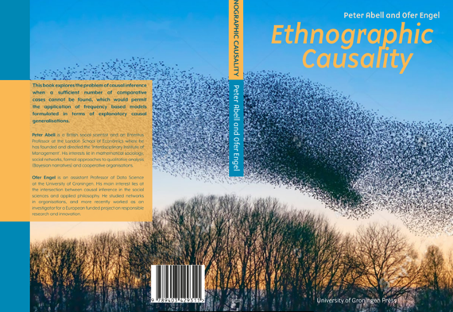

<style>
.column-left{
  float: left;
  width: 60%;
  text-align: left;
}
.column-right{
  float: right;
  width: 40%;
  text-align: right;
  padding-left: 10px;
}
.column-full{
  float: none;
  width: 100%;
  text-align: left;
}


.RUsers {
  padding: 1em;
  background: aliceblue;
  color: black;
}


.SPSS {
  padding: 1em;
  background: whitesmoke;
  color: black;
}

</style>

```{r setup, include=FALSE}
knitr::opts_chunk$set(echo = F)
library(knitr)
```

<div class="column-left">
Recent years have seen the emergence of new methods designed to probe into causal inference, at the intersection of three academic traditions: In the computer sciences, Judea Pearl won the Alan Turing prize in 2011 for fundamental contributions to artificial intelligence through the development of a Bayesian probabilistic framework for causal reasoning. In the social and economic sciences, Joshua Angrist and Guido Imbens were awarded the 2021 Nobel prize for their methodological contributions to the analysis of causal relationships, their insights spreading to a wide range of fields and were said to “revolutionise” empirical research3. In the philosophy of sciences, Nancy Cartwright and James Woodward have grounded these achievements within normative and epistemological foundations, prompting the rise of manipulability theories of causation.4 Drawing on ideas in artificial intelligence, the social sciences and philosophy, this course will introduce you to emerging ways of seeing the world around us.

</div>


<div class="column-right">
```{r course-structure, fig.width=4}

```
</div>

### Aim: 

Upon the successful completion of this course, I hope you will be able to achieve three things:

1. You will have been exposed to a wide range of methods of causal analysis, and acquire familiarity with their pros and cons. 

2. You will become more familiar with the terminology that is used in contemporary social research regarding causal inference.
 
3. You will be able to identify weaknesses of research making claims about causal mechanisms; recognize implicit assumptions that drive those claims and critique those assumptions and their limitations. 


### Method

The course is designed to follow the flipped-classroom approach. Readings and videos of the lectures are available before the course begins. You will be expected to read the relevant chapters in the textbook, watch the videos, and comment on them in Perusall PRIOR to attending the course. 
During the course itself, you will work on quizzes and lab assignments, which you may then submit at the end of each day. 


<div class="column-left">

#### Prepare

To prepare for the course, please complete the preparation assignments, all available on the Perusall platform. You can find the assignments in Nestor under `Assignments`.  You then need to click on the title of the item: `CLICK ME to access Perusall`. 

Completing the assignment involves watching the video and reading the text before the assigned deadlines. 

</div>


<div class="column-right">
```{r perusall, fig.width=4}

include_graphics("images/Perusall.jpg")

```
</div>


### Resources

Online (Nestor, Perusall, github): lectures, presentations, data-sets and exercises and background literature

To brush up on your R programming skills, there are a variety of free resources you can use, such as the [SICSS bootcamp](https://sicss.io/boot_camp/), Harvard’s famous [R Basics course](https://www.edx.org/course/data-science-r-basics), or Stanford’s [R Programming fundamentals](https://www.edx.org/course/r-programming-fundamentals). If you speak German, [this site](https://shiny.lmes.uni-potsdam.de/startR/) is quite nice.

You may work and submit your assignments using any  statistical software including SPSS, STATA, Python, SCALA or Julia. However, as R is becoming the lingua franca of data science in many academic circles, this is going to be the default technology used in this course. 


```{r penguins, fig.width=4}

# include_graphics("images/course-structure.jpg")
include_graphics("images/index-penguins.jpg")

```


